# Tutorial: Store Azure Media Services Events in Azure Log Analytics

In this tutorial you will learn how to store Azure Media Services events in Azure Log Analytics.
> [!div class="checklist"]
> * create a no code Logic App Flow
> * Subscribe to Azure Media Services Event Topics
> * Parse Events and store to Azure Log Analytics
> * Query Events from Azure Log Analytics

If you don’t have an Azure subscription, create a [free account](https://azure.microsoft.com/free/?WT.mc_id=A261C142F) before you begin.

## prerequisites:
> * Azure Subscription
> * AMS account already created
> * Log Analytics Workspace already created

## Azure Media Services Events
Azure Media Services v3 emits events on [Azure Event Grid](https://docs.microsoft.com/en-us/azure/media-services/latest/media-services-event-schemas). You can subscribe to these events in many ways and store the events in various data stores. In this tutorial we will subscribe to these events using a [Log App Flow](https://azure.microsoft.com/en-us/services/logic-apps/). The Logic App will be triggered for each event and store the body of the event in Azure Log Analytics. Once the events are in [Azure Log Analytics](https://docs.microsoft.com/en-us/azure/azure-monitor/learn/quick-create-workspace) we can use other Azure services to monitor, dashboard and alert on these events as desired by your own needs.

For this tutorial we expect you already have an [Azure Media Services](https://docs.microsoft.com/en-us/azure/media-services/latest/create-account-howto) account. During the creation of the Logic App flow we also need to specify an Azure Log Analytics Workspace. 
**It is best you already set one up now using these simple steps: [Quick Create Workspace](https://docs.microsoft.com/en-us/azure/azure-monitor/learn/quick-create-workspace)**

## Walkthrough Steps
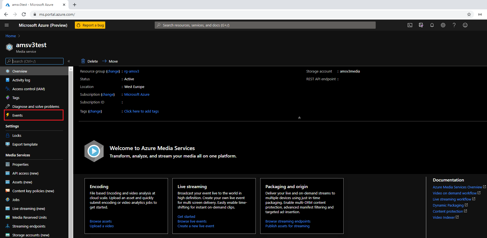

In the Azure portal, navigate to your Azure Media Services account and click "Events" on the left hand side in the navigation pane. This will show all the various ways to subscribe to the Azure Media Services events.


Click on the "Logic Apps" icon to create a Logic App.


This will open the Logic App Designer where we can create the flow to capture the events and push them to Log Analytics. First step here is to click  the + sign on the right. This will allow us to authenticate and subscribe to the Event Grid.


Once the authentication is complete you should see the user email and a green checkmark. Click "Continue" to subscribe to the Media Services Events.


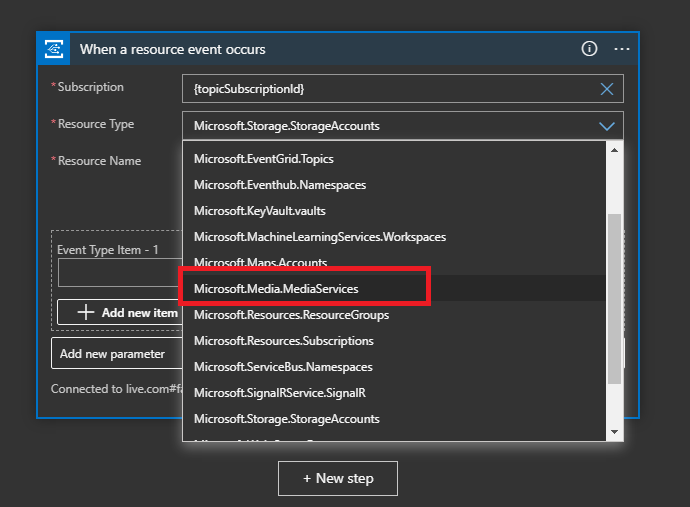

In the "Resource Type" list locate "Microsoft.Media.MediaServices".


In the "Event Type Item" there will be a list of all the events Azure Media Services emits. You can select the events you would like to track. You can add multiple event types. **Later we will make a small change to the Logic App flow to store each event type in a separate Log Analytics Log and propagate the Event Type name to the Log Analytics Log name dynamically.**


Now we are subscribed to the Event(s) we need to create an action. Since we want to push the events to the Azure Log Analytics service search for "Azure Log Analytics" and select the "Azure Log Analytics Data Collector".


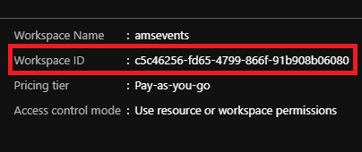

To connect to the Log Analytics Workspace you need the Workspace ID and an Agent Key. In the Azure Portal navigate to your Log Analytics Workspace you created before the start of this tutorial. **To keep the Logic App designer open you can do this in a separate browser tab.** In the Azure Portal, in the Log Analytics workspace you can find the Workspace ID at the top.


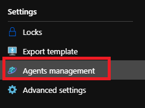

On the left menu locate "Agents Management" and click on it. This will show you the agent keys that have been generated.


Copy one of the keys over to your Logic App.


Now click on "Create".


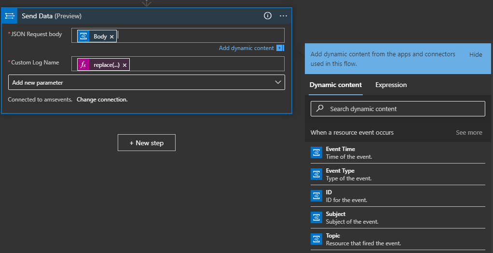

Click "Add Dynamic content" and select "Topic". Do the same for "Custom Log Name".


Go into the "Code View" of the Logic App. We need to change two lines. 
At the top of the json locate the "Inputs" section and change the "body" element as following:

```
"@triggerBody()?['topic']"
```
Replace with
```
"@{triggerBody()}"
```

This is for the purpose to parse the entire message to Log Analytics. Next step is to change the "Log-Type" as following:

```
"@triggerBody()?['topic']"
```

Replace with

```
"@replace(triggerBody()?['eventType'],'.','')"
```

This will replace "." as these are not allowed in Log Analytics Log Names.


It should now look like the picture above.


Click "Save As" at the top.


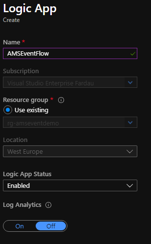

Give the Logic App a name and add it to a resource group.


Let's verify once more, go the the Logic App and click on "Logic app designer"


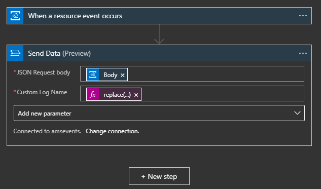

It should look like the picture above.


When we have a look at all the resources in the resource group we can see a Logic App and two Logic App API connectors. One for the Events and one for Log Analytics. There is also an [Event Grid System Topic](https://docs.microsoft.com/en-us/azure/event-grid/system-topics). 


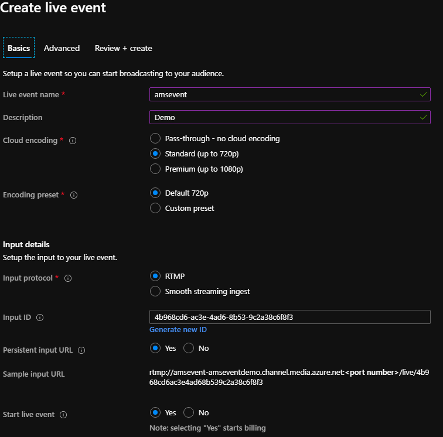

Now we would like see it actually work. To test let's create a Live Event in Azure Media Services. For this test we create a RTMP Live Event and we are going to use ffmpeg to push a "live" stream based on a mp4 sample file. After the event is created you get the RTMP ingest URL. Copy this url over to the ffmpeg commandline below and add a unique name at the end like "mystream" for instance. Adjust the commandline to reflect your test source file and any other system varialbles.
```
ffmpeg -i bbb_sunflower_720p_25fps_encoded.mp4 -map 0 -c:v libx264 -c:a copy -f flv rtmp://amsevent-amseventdemo-euwe.channel.media.azure.net:1935/live/4b968cd6ac3e4ad68b539c2a38c6f8f3/mystream
```


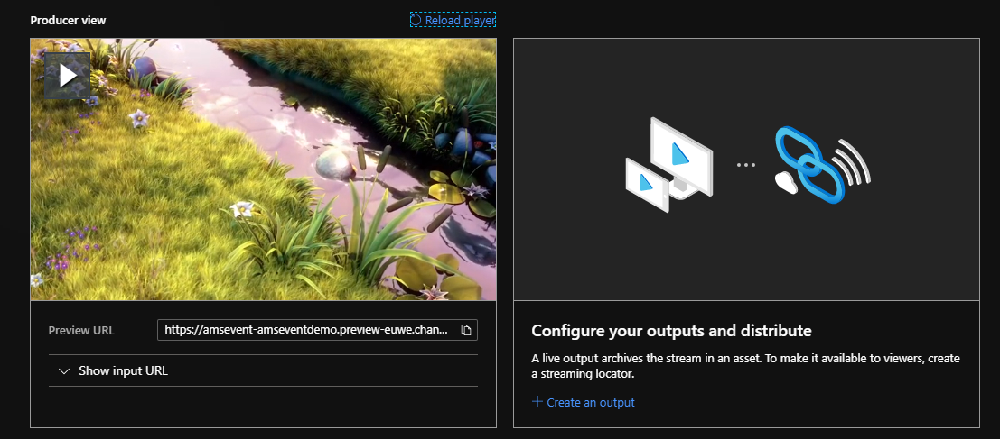

After a couple seconds you should see the stream in the "Producer view" player. **Refresh the player if needed**

By now we have a livestream so Azure Media Services is emitting various events that are triggering the Logic App flow. To verify navigate to the Logic App and see if can see any triggers being fired by the events from Media Services.


In the Logic App Overview page we should see "Run History" at the bottom of the page with jobs that have completed successfully.


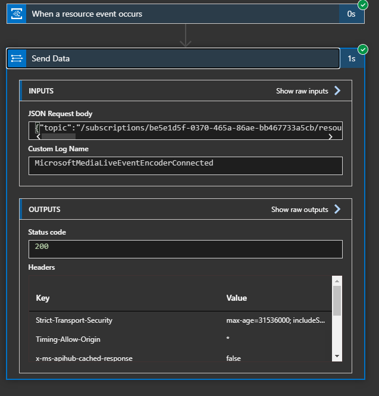

When you click on a Successful Job you can see the details of the job during runtime. In this case you can see that the "MicrosoftMediaLiveEventEncoderConnected" event was captured and we can see the parsed body. This is what is pushed to the Azure Log Analytics Workspace. Let’s go the Log Analytics Workspace to verify. Navigate to Log Analytics Workspace you created earlier.


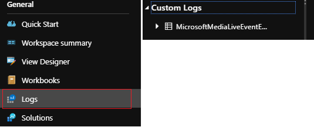

In the Log Analytics click on "Logs" in the left menu. This should open de Log Query. There should be a "Custom Logs" with the event name "MicrosoftMediaLiveEventEncoderConnected". **Note: You may need to refresh the page. The first time it can take a couple minutes to create the custom log and the data to populate.**


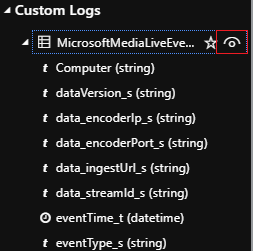

You can expand to see all the fields for this event. When you click on the "eye" icon you can see a preview of the query result.


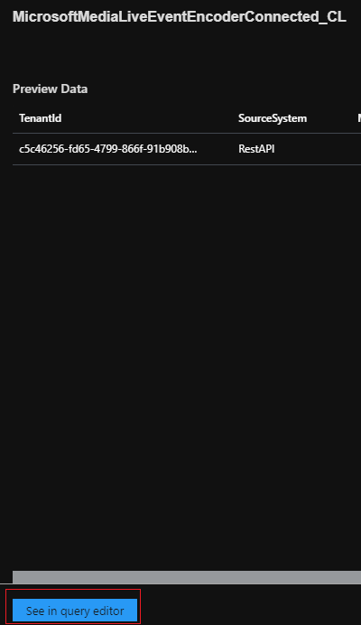

You can click "See in query editor" to see the raw data of all fields.


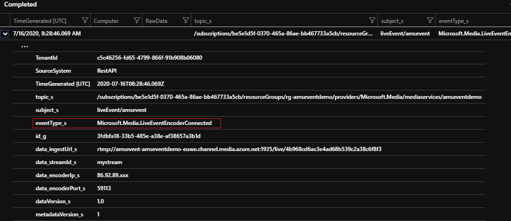

This is the output from the query where we see all the data of the event "MicrosoftMediaLiveEventEncoderConnected".

## Next steps:
You can create different queries and save them. These can be added to [Azure Dashboard](https://docs.microsoft.com/en-us/azure/azure-monitor/learn/tutorial-logs-dashboards).
