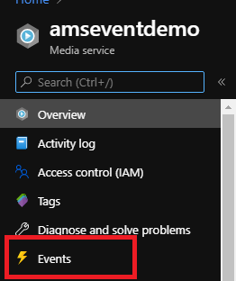
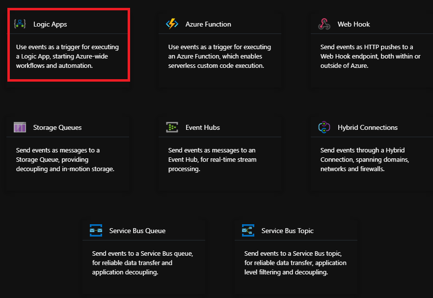
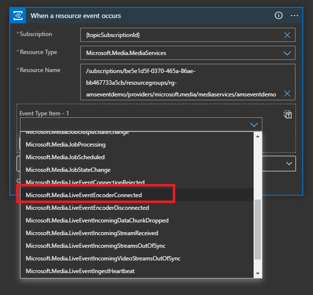
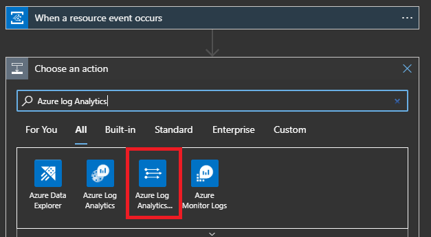
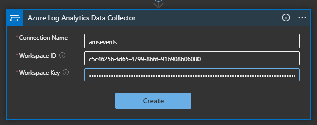

# AzureMediaServicesEventstoLogAnalytics
Store Azure Media Services Events in Azure Log Analytics

Azure Media Services v3 emits events on [Azure Event Grid](https://docs.microsoft.com/en-us/azure/media-services/latest/media-services-event-schemas). You can subscribe to these events in many ways and store the events in various data stores. In this tutorial we will subscribe to these events using a [Log App Flow](https://azure.microsoft.com/en-us/services/logic-apps/). The Logic App will be triggered for each event and store the body of the event in Azure Log Analytics. Once the events are in [Azure Log Analytics](https://docs.microsoft.com/en-us/azure/azure-monitor/learn/quick-create-workspace) we can use other Azure services to monitor, dashboard and alert on these events as desired by your own needs.

For this tutorial we expect you already have an [Azure Media Services](https://docs.microsoft.com/en-us/azure/media-services/latest/create-account-howto) account. During the creation of the Logic App flow we also need to specify an Azure Log Analytics Workspace. It is best you already set one up now using these simple steps: [Quick Create Workspace](https://docs.microsoft.com/en-us/azure/azure-monitor/learn/quick-create-workspace)

## prerequisites:
- Azure Subscription
- AMS account created
- Log Analytics Workspace

## Walktrhough Steps

Navigate to your Azure Media Services account and click “Events” on the left hand side of the navigation pane. This will show all the various ways to subscribe to the Azure Media Services events.

Click on the “Logic Apps” icon to create a Logic App.

This will open the Logic App Designer where we can create the flow. First step here is to click  the + sign on the right. This will allow us to authenticate and subscribe to the Event Grid.

Once the authentication is complete you should see the user’s email and a green checkmark. Click “Continue” to subscribe to the Media Services Events.

The “Resource Type” list locate “Microsoft.Media.MediaServices”.

In the “Event Type Item” there will be a list of all the events Azure Media Services emits. You can select the events you would like to track. You can add multiple event types. Note: Later we will make a small change to the Logic App flow to store each event type in a separate Log Analytics Log and propagate the Event Type name to the Log Analytics Log name.

Now we are subscribed to the Event(s) we need to create an action. Since we want to push the events to Log Analytics service search for “Azure Log Analytics” and select the “Azure Log Analytics Data Collector”

To connect to the Log Analytics Workspace you need the Workspace ID and an Agent Key. In the Azure Portal navigate to your Log Analytics Workspace. Note: To keep the Logic App designer open it is best to do this in a separate browser tab. At the Top you can find the Workspace ID.

On the left locate “Agents Management” and click on it. This will show you a Agent Keys that have been generated. 

Copy one of the keys over to your Logic App.

Now click on “Create”.

Click “Add Dynamic content” and select “Topic”. Do the same for “Custom Log Name”.

Go into the ‘Code View” of the Logic App. We need to change two lines. 
At the top of the json locate the “Inputs” section and change the “body” element as following:

